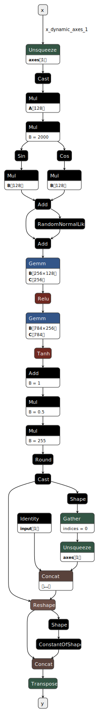

# Mnist Clock

[Running ONNX model in your browser](https://github.com/microsoft/onnxruntime) to generate clock digits on the fly. 

# Live Demo

https://tecbar.github.io/mnist-clock/

# Training

Training from scratch and eporting to ONNX: [pytorch-traning/mnist-clock.py](./pytorch-training/mnist_clock.py)

# JavaScript / TypeScript code

See [angular-onnx/src/app/app.component.ts](./angular-onnx/src/app/app.component.ts)

# ONNX model

See [/angular-onnx/src/assets/model.onnx](./angular-onnx/src/assets/model.onnx) or
run python script yourself to train and generate ONNX model.

---
Model visualization thanks to https://github.com/lutzroeder/netron